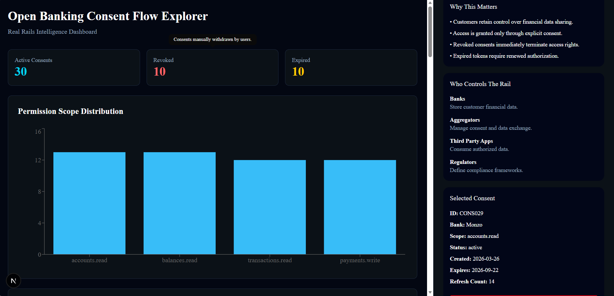

# Open Banking Consent Flow Explorer

Real Rails Intelligence Dashboard for visualizing Open Banking consent management, permission scope analytics, token lifecycle monitoring, and consent intelligence workflows.

---

## Dashboard Preview



---

## Overview

Open Banking Consent Flow Explorer is an interactive intelligence dashboard designed to provide visibility into customer consent management across Open Banking ecosystems.

The application combines consent analytics, permission scope visualization, token lifecycle monitoring, audit workflows, consent revocation, and intelligence insights into a single operational dashboard.

Built using FastAPI and Next.js, the project follows the Real Rails Intelligence Dashboard architecture and emphasizes transforming raw consent data into actionable insights.

---

## Technology Stack

### Frontend

* Next.js
* TypeScript
* Tailwind CSS
* shadcn/ui
* Recharts
* React Flow
* Axios

### Backend

* FastAPI
* Python

---

## Data Sources

The project uses a synthetic Open Banking consent dataset designed to simulate realistic consent lifecycle activity.

### Synthetic Dataset Includes

* 50 consent records
* Multi-bank consent records
* Permission scope distribution
* Active consents
* Revoked consents
* Expired consents
* Token refresh history
* Consent lifecycle events

### Referenced Resources

* Open Banking UK
* Plaid Documentation
* TrueLayer Documentation

---

## Features

### Permission Scope Analytics

Visualizes Open Banking permission scope distribution using interactive charts.

Supported scopes:

* accounts.read
* balances.read
* transactions.read
* payments.write

---

### Consent Audit Log

Displays operational consent history.

Fields include:

* Consent ID
* Bank
* Scope
* Status
* Refresh Count

Selecting a row updates the intelligence sidebar.

---

### Token Expiry Simulator

Simulates token lifecycle behavior for the selected consent.

Displays:

* Days Remaining
* Token Status
* Expiry Risk
* Refresh Count

States:

* Active
* Expiring Soon
* Expired

---

### Consent Revocation Workflow

Allows users to revoke consent directly from the dashboard.

Updates:

* Selected Consent
* Metrics Cards
* Audit Log
* Dashboard State

Revocation requests are persisted through the FastAPI backend and remain effective after page refreshes.

---

### Dashboard Filters

Supports real-time filtering across the entire dashboard.

#### Bank

* HSBC
* Barclays
* Lloyds
* Monzo
* Santander

#### Status

* Active
* Expired
* Revoked

#### Scope

* accounts.read
* balances.read
* transactions.read
* payments.write

### Filter Behavior

Filters dynamically update:

* Audit Log
* Metrics Cards
* Permission Scope Chart
* Exported Dataset

---

### Data Export

Supports exporting currently filtered records.

#### JSON Export

Downloads:

```json
consents.json
```

#### CSV Export

Downloads:

```csv
consents.csv
```

Exports contain only the currently filtered consent records.

---

### Open Banking Consent Flow Visualization

Interactive flow diagram built using React Flow.

Flow:

```text
Customer
      ↓
Consent Granted
      ↓
Bank
      ↓
Aggregator
      ↓
Third Party App
```

Features:

* Zoom Controls
* Pan Controls
* Interactive Visualization
* Background Grid

---

### Intelligence Sidebar

Provides contextual intelligence layers.

Includes:

#### Why This Matters

Explains Open Banking consent significance.

#### Who Controls The Rail

Explains ecosystem stakeholders:

* Banks
* Aggregators
* Regulators
* Third Party Providers

#### Dashboard Intelligence

Provides:

* Risk Indicator
* Current Dashboard Context
* Operational Insights

#### Selected Consent Intelligence

Displays:

* Consent ID
* Bank
* Scope
* Status
* Creation Date
* Expiry Date
* Refresh Count

---

### Tooltips

Interactive tooltips are available on dashboard metric cards to provide additional context about consent status metrics.

---

## Dashboard Layout

The dashboard follows the Real Rails Intelligence Dashboard standard.

### Main Stage (70%)

* Metrics Cards
* Permission Scope Analytics
* React Flow Consent Diagram
* Audit Log

### Intelligence Sidebar (30%)

* Why This Matters
* Who Controls The Rail
* Selected Consent
* Token Simulator
* Dashboard Intelligence
* Filters
* Export Controls

---

## System Architecture

```text
Next.js Frontend
        │
        ▼
FastAPI Backend
        │
        ▼
Synthetic Consent Dataset
        │
        ▼
Analytics + Intelligence Layer
        │
        ▼
Dashboard Visualizations
```

---

## API Endpoints

### Metrics

```http
GET /api/metrics
```

Returns:

* Active Consents
* Revoked Consents
* Expired Consents

---

### Consent Records

```http
GET /api/consents
```

Returns all consent records.

---

### Individual Consent

```http
GET /api/consents/{consent_id}
```

Returns a specific consent record.

---

### Permission Scope Analytics

```http
GET /api/scopes
```

Returns permission scope distribution.

---

### Token Analytics

```http
GET /api/token-analytics
```

Returns token refresh statistics.

---

### Revoke Consent

```http
POST /api/revoke/{consent_id}
```

Updates consent status to revoked and persists the change.

---

## Project Structure

```text
POC-16-Open-Banking-Consent-Flow-Explorer-Gopika

├── backend/
│   ├── app/
│   └── requirements.txt
│
├── frontend/
│   ├── app/
│   ├── components/
│   ├── lib/
│   └── package.json
│
├── screenshots/
│   ├── Dashboard.png
│   ├── Consent_Flow.png
│   ├── AuditLog.png
│   ├── Filters.png
│   └── Revoke_Consent.png
│
├── README.md
├── VAR_REPORT.md
├── UAT_CHECKLIST.md
└── .gitignore
```

---

## Local Setup

### Backend

```bash
cd backend

pip install -r requirements.txt

uvicorn app.main:app --reload
```

Runs on:

```text
http://localhost:8000
```

---

### Frontend

```bash
cd frontend

npm install

npm run dev
```

Runs on:

```text
http://localhost:3000
```

---

## Validation Documents

The repository includes:

* VAR_REPORT.md
* UAT_CHECKLIST.md

These documents validate:

* Visualization Quality
* Dashboard Compliance
* Functional Testing
* User Acceptance Testing

---

## Future Enhancements

* OAuth Consent Simulation
* Real Open Banking API Integration
* Live Consent Monitoring
* Real-Time Token Events
* Regulatory Compliance Insights
* Multi-Bank Comparative Analytics

---

## Author

**Gopika T P**

POC #16 – Open Banking Consent Flow Explorer

Real Rails Intelligence Library
